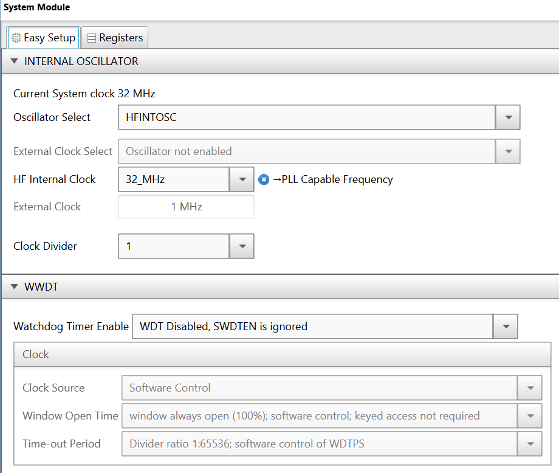
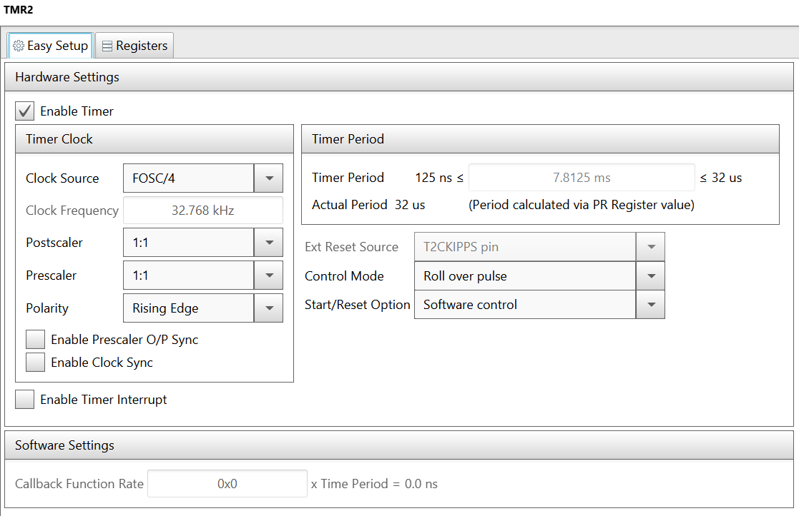
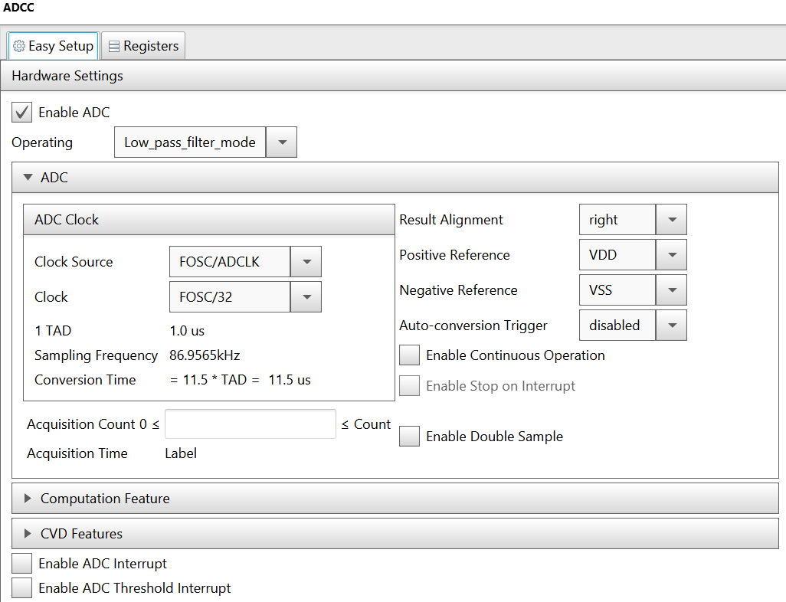
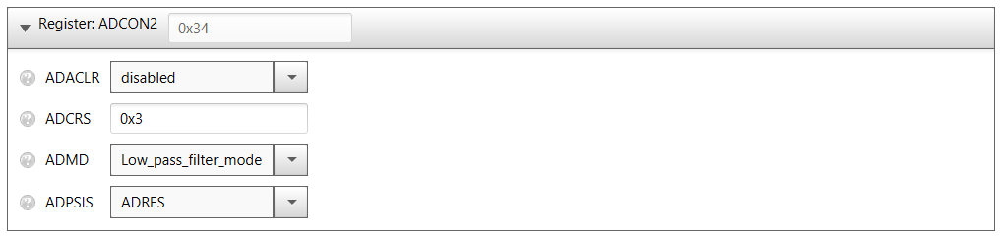
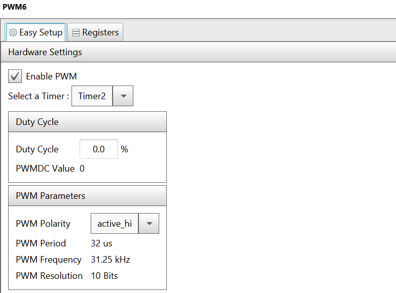
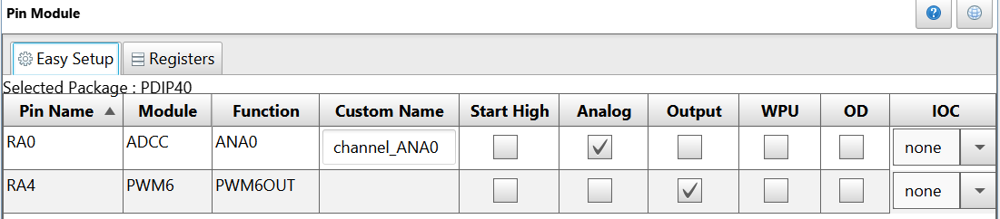
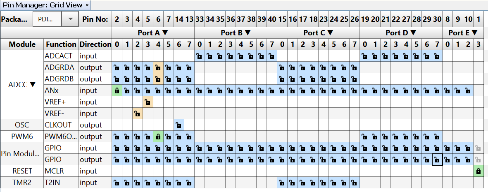
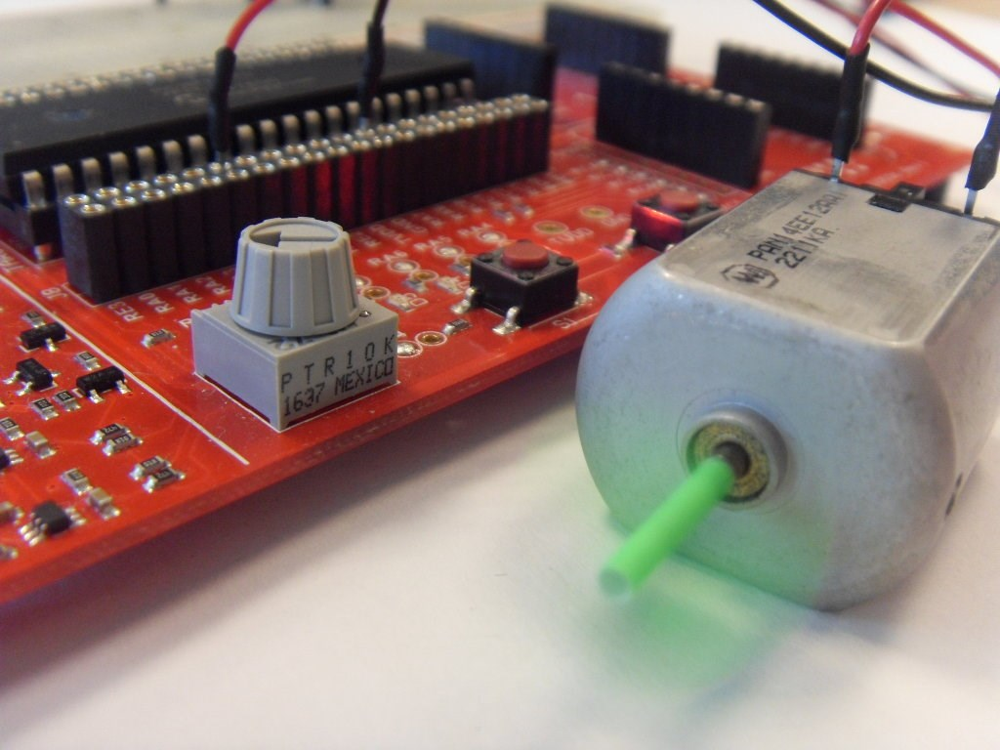
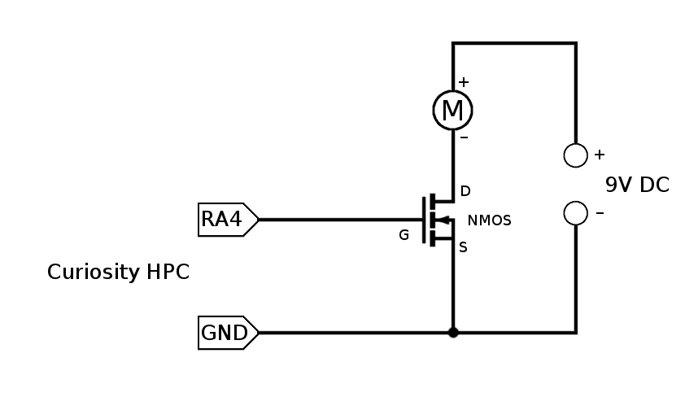

<article class="markdown-body entry-content p-3 p-md-6" itemprop="text">

# PIC16F18875 Control DC Motor with PWM

## Objective:
In this application, the PIC16F18775 is used to generate the PWM signal to control a DC motor. The duty cycle of the PWM is adjusted according to the analog voltage read from the onboard potentiometer. The potentiometer is read using the ADCC set in Low Pass Filter mode, in order to reduce the noise.

## Demo Configuration:

The PIC uses the Burst Average mode of the ADCC to read the 3 sensors at power on, and then it uses those 3 values as setpoints. The alarm will sound if a sensor reading exceeds its setpoint by a specified value, which is written in the ADUTHL register. For an increased accuracy, the gas sensors require up to 48h of heating time, so the user can leave the circuit powered for that period, and then reset the setpoints by resetting the power.

The MCU uses the high frequency internal oscilator (HFINTOSC), and the clock is set to 32 MHz. Watchdog Timer is not used in this demo, so it is disabled. 
MCC configurations, Internal Oscillator and WWDT:

* Oscillator Select: HFINTOSC
* HF Internal Clock: 32_MHz
* Clock Divider: 1
* Watchdog Timer Enable: WDT Disabled, SWDTEN is ignored.

The settings are presented in the figure below.

Timer 2 is used as clock source for the PWM signal.
MCC configurations for TMR2:

* Enable Timer: checked
* Clock Source: FOSC/4
* Postscaler: 1:1
* Prescaler: 1:1
* Polarity: Rising Edge
* Control Mode: Roll over pulse
* Start/Reset Option: Software control

The settings are presented in the figure below.

ADCC is used to read the potentiometer. It is configured to operate in Low pass filter mode, with a frequency of FOSC/32. 
MCC configurations for ADCC - Easy Setup:

* Enable ADC: checked
* Operating: Low pass filter mode
* Clock Source: FOSC/ADCLK
* Clock: FOSC/32
* Result Alignment: right
* Positive Reference: VDD
* Negative Reference: VSS
* Auto-conversion Trigger: disabled

The settings are presented in the figure below.

For the Low pass filter mode, there are two more settings that must be configured from the Register view: the ADRPT (ADC Repeat Threshold bits) and ADCRS (ADC Accumulated Calculation Right Shift Select bits).

* ADRPT: 0x8
* ADCON2 - ADCRS: 0x3

The registers configurations are presented below.

The PWM6 is used to generate the PWM signal for the motor. It uses the TMR2 as clock source. The duty cycle is updated at runtime according to the value read from the potentiometer. 

* Enable PWM6: checked
* Select a Timer: Timer2
* Duty Cycle: 0.0%
* PWM Polarity: active_high

The settings are presented in the figure below.

The pins are configured as follows:

* ADCC input on RA0, named channel_ANA0 (analog input)
* PWM6 output on RA4 (digital output)

The settings are presented in the figure below.

The prototype demo is presented in the picture below.

## Demo Usage:

1. Make the connections according to this schematic:

2. Build demo firmware and load the generated hex file onto the MCU.
3. Rotate the potentiometer to adjust the DC motor speed. 

## Required Tools

Hardware tools:

* PIC16F18875 Curiosity Nano
* Curiosity High Pin Count (HPC)
* Power NMOS transistor: F15N60E / IRF540N / etc.
* DC motor: PAN14EE12AA1/ other similar
* Power supply for the DC motor: 9V 1.3A / other, depending on the motor

Software tools:

* MPLAB® X IDE v5.30
* MPLAB® Code Configurator (Plugin) v3.95
* XC8® Compiler v2.10
* Microcontrollers and peripherals Library v1.79

## Conclusion:

This example shows how easy it is to use the PIC16F18875 and MCC to read the onboard potentiometer using the ADCC and generate a PWM signal to drive a DC motor.
